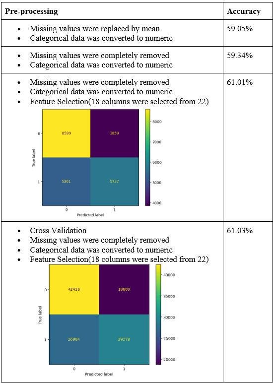

# Airlines-Passenger-Satisfaction-Analysis
# 📌 Project Background 

In the dynamic landscape of the aviation industry, ensuring passenger satisfaction is paramount for airlines seeking to thrive in a highly competitive market. Understanding and enhancing the passenger experience has become a strategic imperative, with airlines increasingly turning to cutting-edge technologies like machine learning to gain valuable insights and improve service quality. This project aims to leverage machine learning techniques to analyze and enhance airlines' passenger satisfaction. By harnessing the power of data analytics and predictive modeling, we aspire to predict customer satisfaction based on the 24 parameters in the database. The ultimate goal is to empower airlines to proactively address customer needs, optimize operational efficiency, and elevate the overall travel experience.

This project uses the datasets [dataset](https://www.kaggle.com/datasets/ahmedshahriarsakib/usa-real-estate-dataset/data](https://www.kaggle.com/datasets/binaryjoker/airline-passenger-satisfaction/data) from Kaggle.

<i>In collaboration with Fazil Ahmed, Richa Kapuskari, Shri Hari Sekar, Ziyue Zhang.</i>  

# 📊 Data Pre-Processing  
1. Data Collection:
   Gather relevant data from various sources, such as airline surveys, customer feedback forms, and social media interactions.
   Proportion of class variable:
    
       
    
   Proportion of class satisfied: 56428/117844 = 0.47
   Proportion of class neutral/dissatisfied = 61416/117844 = 0.53
2. Data Preprocessing: 
   Clean and prepare the data for analysis, including handling missing values, encoding categorical variables, and scaling numerical variables. We performed the following steps in pre-processing the data:
   - Missing Values:
     Finding the rows which have null values. Out of 117844, only 364 rows were having null values. Only 0.3% data has null values so we tried two ways to handle missing values:
     i. Remove it from the dataset
     ii. Replace null values with mean of the column
      
         
      

   - Handling Categorical Data:
     Secondly there were 5 categorical columns which we converted into numeric. The columns were Gender, Customer Type, Type of Travel, Customer Class, Satisfaction
      
         
      
        
   - Scaling the Values:
     Scaling all columns so that all values are in a similar range and no column gets any higher weight.
      
         
      
     
   - Feature Selection:
     There are a total 22 input columns to predict passenger satisfaction. All the columns might not be necessary. So we plotted a correlation heatmap to find out columns which have very little relation in predicting the customer satisfaction. Below is the generated         heatmap.
      
         
      
      
         
      

     Below are the correlation values for columns with customer satisfaction. The values which are very close to zero, we planned to not consider such columns since they are very less correlated to the output column.
      
         
      

     So we removed below columns while predicting the target value:
        i. Departure_arrival_time_convenient
        ii. Gate_location
        iii. Departure_delay_in_minutes
        iv. Arrival_delay_in_minutes

# 👣 Model Selection and Training  
1. Naive Bayes:
   It is a simple, effective model and easy to implement. It also works well with large and categorical datasets.
    
       
    
  
2. Logistic Regression:
   Logistic regression can scale effectively to large datasets and is   less prone to overfitting.
    
       
      
  
3. Decision Tree:
   We thought of using Decision trees because they are a versatile and powerful machine learning algorithm. It works well with large datasets and can be combined into ensemble methods and  provide a measure of feature importance, indicating which features are more 
   influential in making predictions.
    
       
      
   Stratified accuracy for unsatisfied class: 0.94
   Stratified accuracy for satisfied class: 0.99

#### Model Evaluation:
Evaluated the performance of the trained models using accuracy metric because the proportion of class is almost the same for target variables.

1. Naive Bayes:
    
       
    

2. Logistic Regression:
    
       
    

3. Decision Tree:
    
       
    

## Best Model: Decision Tree
    
       
    
    
       
    
   Out of all the models we performed, Decision tree gave the highest accuracy i.e 94.31 % when Missing values were completely removed, Categorical data was converted to numeric, Values were scaled and Feature Selection was done (18 columns were selected from 22)

## Impact of pre-processing on accuracy?
- Impact of Preprocessing Missing values on Accuracy: 
  As we can see from the above results, pre-processing did not help much to improve the accuracy. The reason is we have a total of 129880, out of which only 393 rows were missing values/ This is actually just 0.3 % of the total rows which is a very small number. This   
  is the reason that preprocessing the missing values did not have a significant impact on accuracy.

- Impact of Feature Selection on accuracy: 
  Feature selection is an important process which helps in considering only the relevant columns for target value prediction. It helped in increasing the accuracy by following
  Naive Bayes: Accuracy improved from 59% to 61%
  Logistic Regression: 78 to 86%
  Decision Tree: 94 to 94.31

- Impact of Scaling : 
  Scaling made all the values in a similar range and helped to make more accurate predictions. In case of logistic regression, it increased accuracy from 78 to 86%. 

- Cross Validation: 
  To make sure that the model gets all patterns of data, we used cross validation technique. It accuracy was not changed much due to this  

## Benefits of Airline Satisfaction Prediction
Predicting airline passenger satisfaction offers several advantages:
- Proactive customer service: Identify potential dissatisfaction issues early and take corrective actions.
- Targeted marketing campaigns: Tailor marketing efforts to specific customer segments based on satisfaction levels.
- Resource allocation: Prioritize resources effectively to address areas of highest dissatisfaction.
- Improved brand reputation: Enhance customer perception and brand loyalty through consistent satisfaction.

## Challenges in Airline Satisfaction Prediction
Despite its benefits, airline satisfaction prediction faces certain challenges:
- Data quality: Ensuring the accuracy, completeness, and relevance of data is crucial for reliable predictions.
- Model bias: Identifying and mitigating potential biases in the data and algorithms to avoid unfair or discriminatory outcomes.
- Evolving customer expectations: Continuously adapting the models to keep pace with changing customer preferences and expectations.
- Interpretability: Understanding the factors that influence satisfaction levels to provide insights for improvement.

## Suggestion to the Airlines based on analysis:
1. Customers were not very happy with the inflight wifi service provided by the airlines. Most of the customers rated the wifi services as 3 or 4. The airlines can try to improve on it
    
       
    
2. Among all the customers, we found out that the most unsatisfied customers range between the age of 20 to 35.
    
       
    
3. These customers aging between 20-35 were majorly having issues with the checkin service. The Younger generation wants everything to be fast paced and so the customers were not happy with the checkin service. Airlines can try to increase the number of check in counters.
    
       
    

# ☁️ Conclusions
Machine learning offers a valuable tool for airlines to predict and improve passenger satisfaction. By leveraging ML, airlines can gain valuable insights into customer preferences, identify areas for improvement, and proactively address potential dissatisfaction issues. As the aviation industry continues to evolve, ML will play an increasingly important role in enhancing customer satisfaction and driving long-term success.
